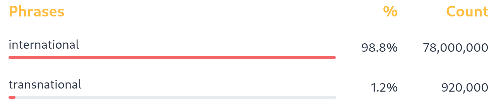

## [transnational]{.target}, *adj*. [across]{.cloze-word} countries
- **nation**: a country
- **al**: related to

### Examples

- By the mid-1970s, [transnational]{.target} firms controlled 27% of industrial production.
- This is the first book to provide an accessible yet rigorous overview of [transnational]{.target} migration.
- During the last two decades, Europe has experienced a rise in [transnational]{.target} contention.

Transnational and international have similar meanings, but international is much more common. Transnational focuses on [the movement from one country to another]{.cloze-line} and is use mostly in sociological and economic contexts. International focuses on [the movement between countries (from one country to another and back)]{.cloze-line}, and is used in any context.

## [transdermal]{.target}, *adj*. [through]{.cloze-word} the skin
- **derm(is)**, Greek [δέρμα], the skin
- **al**: related to

### Examples
- For many who wear [transdermal]{.target} patches, issues have arisen from the accidental exposure of used, and new, patches in those of children.
- Hormonal birth control is one form of hormone therapy, but women who aren’t trying to prevent pregnancy often choose [transdermal]{.target} estrogen supplementation, through a patch or cream, which doesn’t have the same risk of blood clotting.
- Injection of testosterone may be safer and more effective than [transdermal]{.target} administration for combating loss of muscle and bone in older men.

## [transpiration]{.target}, *n*. the act of breathing [across]{.cloze-word} something
- **spira**, Latin [spīrāre], to breath
- --**tion**: English, the act of

### Examples

- Some people argued that successful establishment of plants on salt-affected land would cause sufficient [transpiration]{.target} to lower the water table and hence, they thought, solve the problem.
- Planting these trees should increase [transpiration]{.target} and, so, "pump" excess water from the soil.
- Unlike grasses, trees provide strong mechanical reinforcement of the ground and can effect large withdrawals of water for [transpiration]{.target}.

## [translucent]{.target}, *adj*. allowing some light to pass [through]{.cloze-word}
- **lucere**, Latin, to shine
- --**ent**, French, doing the action of the verb (to shine)

### Examples
- Meanwhile, saute the onion in the oil until [translucent]{.target}.
- Three things will be discussed in this book and they are all characteristics of white light: opaque, transparent and [translucent]{.target}.
- the [translucent]{.target} primer has a gel formulation that comfortably sits on skin all day, extending the wear of makeup.

## Find another word that uses *trans*
Just like the examples above, write the word, its part of speech, and its meaning. Then, break the word into parts and give three example sentences. Use the examples above and follow that pattern.

::: {.cloze-paragraph}

:::